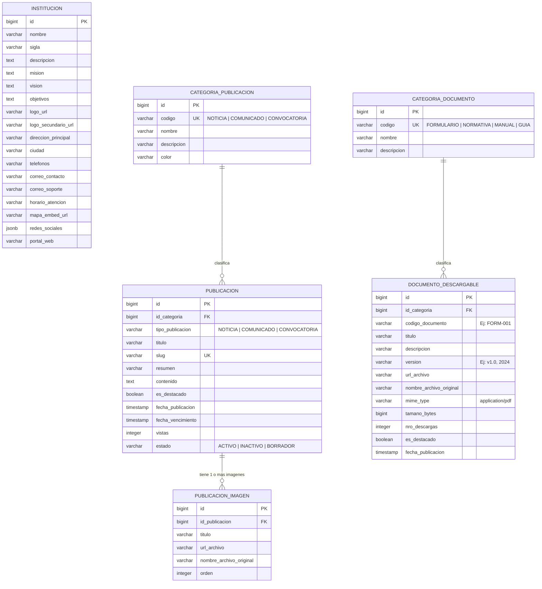

# 📊 Modelo de Base de Datos - Sistema Institucional

## 1. 🎯 Alcance y Requerimientos

El modelo de base de datos está diseñado para cubrir las siguientes necesidades:

1. **Publicaciones**: Gestión de **Comunicados**, **Noticias** y **Convocatorias** con estados, fechas de vigencia y soporte para contenido enriquecido.
2. **Galería de Imágenes (1 a N)**: Almacenamiento de múltiples imágenes asociadas a una publicación, indicando portada/principal, orden de visualización y texto alternativo.
3. **Formularios y Documentos Descargables (PDFs)**: Módulo para que el público descargue formularios oficiales, normativas, manuales y requisitos en formato PDF, con control de versiones y contador de descargas.
4. **Datos de la Institución**: Almacenamiento centralizado de información institucional (misión, visión, dirección, teléfonos, correos, enlaces a redes sociales, horarios y geolocalización).
5. **Auditoría Estándar**: Compatibilidad completa con la clase `AuditoriaEntity` del backend (`_estado`, `_transaccion`, `_usuario_creacion`, `_fecha_creacion`, `_usuario_modificacion`, `_fecha_modificacion`).

---

## 2. 🗺️ Diagrama Entidad-Relación (ERD)



---

## 3. 📋 Diccionario de Datos Detallado

### 3.1. Tabla: `institucion`

Almacena la información institucional de la entidad. Usualmente contendrá 1 solo registro activo.

| Campo                   | Tipo           | Nulo  | Descripción                                                                  |
| :---------------------- | :------------- | :---: | :--------------------------------------------------------------------------- |
| `id`                    | `BIGINT`       | ❌ PK | Identificador único.                                                         |
| `nombre`                | `VARCHAR(255)` |  ❌   | Nombre oficial de la institución.                                            |
| `sigla`                 | `VARCHAR(50)`  |  ❌   | Sigla representativa (ej: _AGETIC_).                                         |
| `descripcion`           | `TEXT`         |  ✔️   | Reseña o descripción general.                                                |
| `mision`                | `TEXT`         |  ✔️   | Misión institucional.                                                        |
| `vision`                | `TEXT`         |  ✔️   | Visión institucional.                                                        |
| `objetivos`             | `TEXT`         |  ✔️   | Objetivos estratégicos o institucionales.                                    |
| `logo_url`              | `VARCHAR(500)` |  ✔️   | URL/Ruta del logotipo principal.                                             |
| `logo_secundario_url`   | `VARCHAR(500)` |  ✔️   | URL/Ruta de logo secundario o favicon.                                       |
| `direccion_principal`   | `VARCHAR(255)` |  ✔️   | Dirección física de la institución.                                          |
| `ciudad`                | `VARCHAR(100)` |  ✔️   | Ciudad / Departamento sede.                                                  |
| `telefonos`             | `VARCHAR(150)` |  ✔️   | Teléfonos de contacto o central telefónica.                                  |
| `correo_contacto`       | `VARCHAR(150)` |  ✔️   | Correo electrónico principal de atención.                                    |
| `correo_soporte`        | `VARCHAR(150)` |  ✔️   | Correo de soporte técnico o denuncias.                                       |
| `horario_atencion`      | `VARCHAR(255)` |  ✔️   | Horario de atención al público.                                              |
| `mapa_embed_url`        | `VARCHAR(500)` |  ✔️   | Enlace o iframe de Google Maps / OpenStreetMap.                              |
| `redes_sociales`        | `JSONB`        |  ✔️   | Objeto JSON con enlaces (Facebook, X, Instagram, YouTube, TikTok, WhatsApp). |
| `portal_web`            | `VARCHAR(255)` |  ✔️   | URL del portal web oficial.                                                  |
| `_estado`               | `VARCHAR(30)`  |  ❌   | Estado del registro (`ACTIVO`, `INACTIVO`).                                  |
| `_transaccion`          | `VARCHAR(30)`  |  ❌   | Tipo de operación ejecutada (`CREAR`, `ACTUALIZAR`).                         |
| `_usuario_creacion`     | `BIGINT`       |  ❌   | ID del usuario creador.                                                      |
| `_fecha_creacion`       | `TIMESTAMP`    |  ❌   | Fecha de creación del registro.                                              |
| `_usuario_modificacion` | `BIGINT`       |  ✔️   | ID del usuario que modificó.                                                 |
| `_fecha_modificacion`   | `TIMESTAMP`    |  ✔️   | Fecha de modificación.                                                       |

---

### 3.2. Tabla: `categorias_publicacion`

Permite clasificar las publicaciones dinámicamente o por código fijo (`NOTICIA`, `COMUNICADO`, `CONVOCATORIA`).

| Campo                               | Tipo           | Nulo  | Descripción                                                      |
| :---------------------------------- | :------------- | :---: | :--------------------------------------------------------------- |
| `id`                                | `BIGINT`       | ❌ PK | Identificador único.                                             |
| `codigo`                            | `VARCHAR(30)`  | ❌ UK | Código único (`NOTICIA`, `COMUNICADO`, `CONVOCATORIA`).          |
| `nombre`                            | `VARCHAR(100)` |  ❌   | Nombre descriptivo de la categoría.                              |
| `descripcion`                       | `VARCHAR(255)` |  ✔️   | Descripción breve.                                               |
| `color`                             | `VARCHAR(20)`  |  ✔️   | Color representativo en hexadecimal para UI (ej: `#004b93`).     |
| `icono`                             | `VARCHAR(50)`  |  ✔️   | Nombre del icono UI (ej: `megaphone`, `newspaper`, `file-text`). |
| `_estado` ... `_fecha_modificacion` | _(Auditoría)_  |   —   | Campos estándar de auditoría.                                    |

---

### 3.3. Tabla: `publicaciones`

Almacena comunicados, noticias y convocatorias.

| Campo                                    | Tipo           | Nulo  | Descripción                                                                    |
| :--------------------------------------- | :------------- | :---: | :----------------------------------------------------------------------------- |
| `id`                                     | `BIGINT`       | ❌ PK | Identificador único de la publicación.                                         |
| `id_categoria`                           | `BIGINT`       | ❌ FK | Referencia a `categorias_publicacion.id`.                                      |
| `tipo_publicacion`                       | `VARCHAR(30)`  |  ❌   | Redundancia útil / Filtro rápido (`NOTICIA`, `COMUNICADO`, `CONVOCATORIA`).    |
| `titulo`                                 | `VARCHAR(255)` |  ❌   | Título de la publicación.                                                      |
| `slug`                                   | `VARCHAR(300)` | ❌ UK | URL amigable única (ej: `convocatoria-desarrollador-fullstack-2024`).          |
| `resumen`                                | `VARCHAR(500)` |  ✔️   | Resumen o bajada de la publicación para listados.                              |
| `contenido`                              | `TEXT`         |  ❌   | Contenido completo (HTML enriquecido o Markdown).                              |
| `es_destacado`                           | `BOOLEAN`      |  ❌   | Indica si se mostrará en el banner principal / carrusel (`DEFAULT false`).     |
| `fecha_publicacion`                      | `TIMESTAMP`    |  ❌   | Fecha y hora en que se publica o programa la publicación.                      |
| `fecha_vencimiento`                      | `TIMESTAMP`    |  ✔️   | Fecha límite (especialmente útil para convocatorias y comunicados temporales). |
| `vistas`                                 | `INTEGER`      |  ❌   | Contador de visitas (`DEFAULT 0`).                                             |
| `_estado`                                | `VARCHAR(30)`  |  ❌   | `PUBLICADO`, `BORRADOR`, `INACTIVO`.                                           |
| `_transaccion` ... `_fecha_modificacion` | _(Auditoría)_  |   —   | Campos estándar de auditoría.                                                  |

---

### 3.4. Tabla: `publicaciones_imagenes`

Almacena las imágenes vinculadas a cada publicación (1 a N).

| Campo                               | Tipo           | Nulo  | Descripción                                                     |
| :---------------------------------- | :------------- | :---: | :-------------------------------------------------------------- |
| `id`                                | `BIGINT`       | ❌ PK | Identificador único de la imagen.                               |
| `id_publicacion`                    | `BIGINT`       | ❌ FK | Referencia a `publicaciones.id` (`ON DELETE CASCADE`).          |
| `titulo`                            | `VARCHAR(255)` |  ✔️   | Título o epígrafe de la imagen.                                 |
| `texto_alternativo`                 | `VARCHAR(255)` |  ✔️   | Atributo `alt` para accesibilidad y SEO.                        |
| `url_archivo`                       | `VARCHAR(500)` |  ❌   | Ruta física o URL pública donde se guardó la imagen.            |
| `nombre_archivo_original`           | `VARCHAR(255)` |  ✔️   | Nombre original del archivo subido.                             |
| `mime_type`                         | `VARCHAR(50)`  |  ❌   | Tipo MIME (ej: `image/jpeg`, `image/png`, `image/webp`).        |
| `tamano_bytes`                      | `INTEGER`      |  ✔️   | Tamaño del archivo en bytes.                                    |
| `es_portada`                        | `BOOLEAN`      |  ❌   | Indica si es la imagen principal / miniatura (`DEFAULT false`). |
| `orden`                             | `INTEGER`      |  ❌   | Orden secuencial dentro de la galería (`DEFAULT 1`).            |
| `_estado` ... `_fecha_modificacion` | _(Auditoría)_  |   —   | Campos estándar de auditoría.                                   |

---

### 3.5. Tabla: `categorias_documento`

Clasifica los documentos descargables (Formularios, Normativas, Manuales, etc.).

| Campo                               | Tipo           | Nulo  | Descripción                                                         |
| :---------------------------------- | :------------- | :---: | :------------------------------------------------------------------ |
| `id`                                | `BIGINT`       | ❌ PK | Identificador único.                                                |
| `codigo`                            | `VARCHAR(30)`  | ❌ UK | Código identificador (`FORMULARIO`, `NORMATIVA`, `MANUAL`, `GUIA`). |
| `nombre`                            | `VARCHAR(100)` |  ❌   | Nombre de la categoría (ej: _Formularios de Trámites_).             |
| `descripcion`                       | `VARCHAR(255)` |  ✔️   | Descripción breve.                                                  |
| `_estado` ... `_fecha_modificacion` | _(Auditoría)_  |   —   | Campos estándar de auditoría.                                       |

---

### 3.6. Tabla: `documentos_descargables`

Almacena los archivos PDF (formularios y documentos) para descarga pública.

| Campo                                    | Tipo           | Nulo  | Descripción                                                                |
| :--------------------------------------- | :------------- | :---: | :------------------------------------------------------------------------- |
| `id`                                     | `BIGINT`       | ❌ PK | Identificador único del documento.                                         |
| `id_categoria`                           | `BIGINT`       | ❌ FK | Referencia a `categorias_documento.id`.                                    |
| `codigo_documento`                       | `VARCHAR(50)`  |  ✔️   | Código oficial del formulario (ej: `FORM-KARDEX-01`).                      |
| `titulo`                                 | `VARCHAR(255)` |  ❌   | Nombre o título del documento descargable.                                 |
| `descripcion`                            | `TEXT`         |  ✔️   | Instrucciones de llenado o detalle del documento.                          |
| `version`                                | `VARCHAR(20)`  |  ✔️   | Versión o año del formulario (ej: `v2.1`, `2024`).                         |
| `url_archivo`                            | `VARCHAR(500)` |  ❌   | Ruta o URL del archivo PDF almacenado.                                     |
| `nombre_archivo_original`                | `VARCHAR(255)` |  ❌   | Nombre con el que se subió el PDF.                                         |
| `mime_type`                              | `VARCHAR(50)`  |  ❌   | Formato de archivo (`application/pdf`).                                    |
| `tamano_bytes`                           | `BIGINT`       |  ✔️   | Peso del archivo en bytes.                                                 |
| `nro_descargas`                          | `INTEGER`      |  ❌   | Contador de descargas realizadas (`DEFAULT 0`).                            |
| `es_destacado`                           | `BOOLEAN`      |  ❌   | Si debe aparecer en la sección de "Descargas Populares" (`DEFAULT false`). |
| `fecha_publicacion`                      | `TIMESTAMP`    |  ❌   | Fecha de puesta a disposición del público.                                 |
| `_estado`                                | `VARCHAR(30)`  |  ❌   | `ACTIVO`, `INACTIVO`.                                                      |
| `_transaccion` ... `_fecha_modificacion` | _(Auditoría)_  |   —   | Campos estándar de auditoría.                                              |

---

## 4. 🗄️ Script SQL DDL (PostgreSQL)

```sql
-- =============================================================================
-- ESQUEMA Y TABLAS DEL SISTEMA INSTITUCIONAL
-- =============================================================================

-- 1. Institución
CREATE TABLE IF NOT EXISTS institucion (
    id BIGSERIAL PRIMARY KEY,
    nombre VARCHAR(255) NOT NULL,
    sigla VARCHAR(50) NOT NULL,
    descripcion TEXT,
    mision TEXT,
    vision TEXT,
    objetivos TEXT,
    logo_url VARCHAR(500),
    logo_secundario_url VARCHAR(500),
    direccion_principal VARCHAR(255),
    ciudad VARCHAR(100),
    telefonos VARCHAR(150),
    correo_contacto VARCHAR(150),
    correo_soporte VARCHAR(150),
    horario_atencion VARCHAR(255),
    mapa_embed_url VARCHAR(500),
    redes_sociales JSONB DEFAULT '{}'::jsonb,
    portal_web VARCHAR(255),
    _estado VARCHAR(30) NOT NULL DEFAULT 'ACTIVO',
    _transaccion VARCHAR(30) NOT NULL DEFAULT 'CREAR',
    _usuario_creacion BIGINT NOT NULL,
    _fecha_creacion TIMESTAMP WITHOUT TIME ZONE NOT NULL DEFAULT now(),
    _usuario_modificacion BIGINT,
    _fecha_modificacion TIMESTAMP WITHOUT TIME ZONE
);

-- 2. Categorías de Publicación
CREATE TABLE IF NOT EXISTS categorias_publicacion (
    id BIGSERIAL PRIMARY KEY,
    codigo VARCHAR(30) NOT NULL UNIQUE,
    nombre VARCHAR(100) NOT NULL,
    descripcion VARCHAR(255),
    color VARCHAR(20),
    icono VARCHAR(50),
    _estado VARCHAR(30) NOT NULL DEFAULT 'ACTIVO',
    _transaccion VARCHAR(30) NOT NULL DEFAULT 'CREAR',
    _usuario_creacion BIGINT NOT NULL,
    _fecha_creacion TIMESTAMP WITHOUT TIME ZONE NOT NULL DEFAULT now(),
    _usuario_modificacion BIGINT,
    _fecha_modificacion TIMESTAMP WITHOUT TIME ZONE
);

-- 3. Publicaciones (Noticias, Comunicados, Convocatorias)
CREATE TABLE IF NOT EXISTS publicaciones (
    id BIGSERIAL PRIMARY KEY,
    id_categoria BIGINT NOT NULL,
    tipo_publicacion VARCHAR(30) NOT NULL,
    titulo VARCHAR(255) NOT NULL,
    slug VARCHAR(300) NOT NULL UNIQUE,
    resumen VARCHAR(500),
    contenido TEXT NOT NULL,
    es_destacado BOOLEAN NOT NULL DEFAULT false,
    fecha_publicacion TIMESTAMP WITHOUT TIME ZONE NOT NULL DEFAULT now(),
    fecha_vencimiento TIMESTAMP WITHOUT TIME ZONE,
    vistas INTEGER NOT NULL DEFAULT 0,
    _estado VARCHAR(30) NOT NULL DEFAULT 'ACTIVO',
    _transaccion VARCHAR(30) NOT NULL DEFAULT 'CREAR',
    _usuario_creacion BIGINT NOT NULL,
    _fecha_creacion TIMESTAMP WITHOUT TIME ZONE NOT NULL DEFAULT now(),
    _usuario_modificacion BIGINT,
    _fecha_modificacion TIMESTAMP WITHOUT TIME ZONE,
    CONSTRAINT fk_publicacion_categoria FOREIGN KEY (id_categoria)
        REFERENCES categorias_publicacion(id) ON UPDATE CASCADE
);

CREATE INDEX idx_publicaciones_tipo_estado ON publicaciones(tipo_publicacion, _estado);
CREATE INDEX idx_publicaciones_fecha_pub ON publicaciones(fecha_publicacion DESC);
CREATE INDEX idx_publicaciones_slug ON publicaciones(slug);

-- 4. Galería de Imágenes de Publicaciones (1 a N)
CREATE TABLE IF NOT EXISTS publicaciones_imagenes (
    id BIGSERIAL PRIMARY KEY,
    id_publicacion BIGINT NOT NULL,
    titulo VARCHAR(255),
    texto_alternativo VARCHAR(255),
    url_archivo VARCHAR(500) NOT NULL,
    nombre_archivo_original VARCHAR(255),
    mime_type VARCHAR(50) NOT NULL,
    tamano_bytes INTEGER,
    es_portada BOOLEAN NOT NULL DEFAULT false,
    orden INTEGER NOT NULL DEFAULT 1,
    _estado VARCHAR(30) NOT NULL DEFAULT 'ACTIVO',
    _transaccion VARCHAR(30) NOT NULL DEFAULT 'CREAR',
    _usuario_creacion BIGINT NOT NULL,
    _fecha_creacion TIMESTAMP WITHOUT TIME ZONE NOT NULL DEFAULT now(),
    _usuario_modificacion BIGINT,
    _fecha_modificacion TIMESTAMP WITHOUT TIME ZONE,
    CONSTRAINT fk_imagen_publicacion FOREIGN KEY (id_publicacion)
        REFERENCES publicaciones(id) ON DELETE CASCADE ON UPDATE CASCADE
);

CREATE INDEX idx_imagenes_publicacion_orden ON publicaciones_imagenes(id_publicacion, orden);

-- 5. Categorías de Documentos
CREATE TABLE IF NOT EXISTS categorias_documento (
    id BIGSERIAL PRIMARY KEY,
    codigo VARCHAR(30) NOT NULL UNIQUE,
    nombre VARCHAR(100) NOT NULL,
    descripcion VARCHAR(255),
    _estado VARCHAR(30) NOT NULL DEFAULT 'ACTIVO',
    _transaccion VARCHAR(30) NOT NULL DEFAULT 'CREAR',
    _usuario_creacion BIGINT NOT NULL,
    _fecha_creacion TIMESTAMP WITHOUT TIME ZONE NOT NULL DEFAULT now(),
    _usuario_modificacion BIGINT,
    _fecha_modificacion TIMESTAMP WITHOUT TIME ZONE
);

-- 6. Documentos Descargables (Formularios y PDFs)
CREATE TABLE IF NOT EXISTS documentos_descargables (
    id BIGSERIAL PRIMARY KEY,
    id_categoria BIGINT NOT NULL,
    codigo_documento VARCHAR(50),
    titulo VARCHAR(255) NOT NULL,
    descripcion TEXT,
    version VARCHAR(20),
    url_archivo VARCHAR(500) NOT NULL,
    nombre_archivo_original VARCHAR(255) NOT NULL,
    mime_type VARCHAR(50) NOT NULL DEFAULT 'application/pdf',
    tamano_bytes BIGINT,
    nro_descargas INTEGER NOT NULL DEFAULT 0,
    es_destacado BOOLEAN NOT NULL DEFAULT false,
    fecha_publicacion TIMESTAMP WITHOUT TIME ZONE NOT NULL DEFAULT now(),
    _estado VARCHAR(30) NOT NULL DEFAULT 'ACTIVO',
    _transaccion VARCHAR(30) NOT NULL DEFAULT 'CREAR',
    _usuario_creacion BIGINT NOT NULL,
    _fecha_creacion TIMESTAMP WITHOUT TIME ZONE NOT NULL DEFAULT now(),
    _usuario_modificacion BIGINT,
    _fecha_modificacion TIMESTAMP WITHOUT TIME ZONE,
    CONSTRAINT fk_documento_categoria FOREIGN KEY (id_categoria)
        REFERENCES categorias_documento(id) ON UPDATE CASCADE
);

CREATE INDEX idx_documentos_categoria_estado ON documentos_descargables(id_categoria, _estado);
CREATE INDEX idx_documentos_codigo ON documentos_descargables(codigo_documento);

-- =============================================================================
-- DATOS SEMILLA INICIALES (SEEDS SUGERIDOS)
-- =============================================================================

INSERT INTO categorias_publicacion (codigo, nombre, descripcion, color, icono, _usuario_creacion)
VALUES
('NOTICIA', 'Noticias Institucionales', 'Novedades y notas de prensa', '#1e40af', 'newspaper', 1),
('COMUNICADO', 'Comunicados Oficiales', 'Avisos importantes a la población', '#b91c1c', 'megaphone', 1),
('CONVOCATORIA', 'Convocatorias y Licitaciones', 'Convocatorias públicas y laborales', '#047857', 'briefcase', 1)
ON CONFLICT (codigo) DO NOTHING;

INSERT INTO categorias_documento (codigo, nombre, descripcion, _usuario_creacion)
VALUES
('FORMULARIO', 'Formularios de Trámite', 'Formularios oficiales para trámites ciudadanos', 1),
('NORMATIVA', 'Normativas y Resoluciones', 'Leyes, decretos y resoluciones institucionales', 1),
('MANUAL', 'Guías y Manuales', 'Manuales de usuario y guías informativas', 1)
ON CONFLICT (codigo) DO NOTHING;
```

---

## 5. 💡 Ventajas de este Diseño

1. **Escalabilidad**: Soporta añadir más tipos de publicaciones o categorías de documentos sin cambiar la estructura de tablas.
2. **Imágenes Múltiples**: La tabla `publicaciones_imagenes` permite crear galerías, carruseles y definir explícitamente cuál es la imagen principal (`es_portada`).
3. **Formularios Oficiales**: Permite asignar códigos como `FORM-001`, versiones (`v1.0`, `2024`) y rastrear la cantidad de descargas del PDF.
4. **Datos Institucionales Flexibles**: El campo `redes_sociales` en `JSONB` permite guardar cualquier red social sin alterar columnas.
5. **Auditoría Integrada**: Todas las tablas heredan los campos de auditoría estándar del proyecto NestJS (`AuditoriaEntity`).
